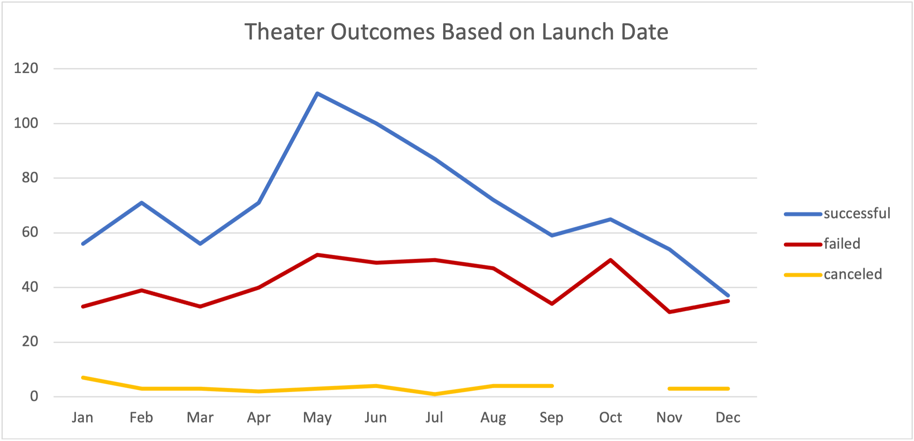
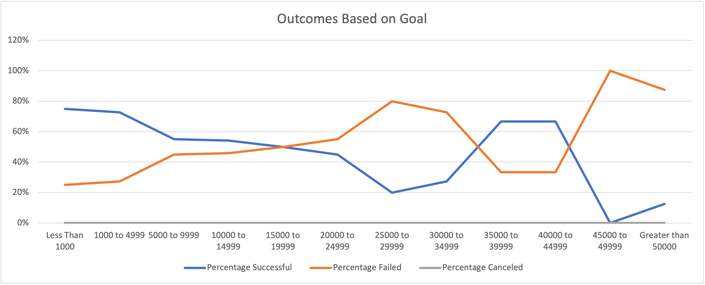

# **Theater Kickstarter Success Analysis**

## This Analysis is to show the most optimal time and funding for a Theater-based Kickstarter

## Analysis and Challenges
Once I was able to compile Theater Kickstarter data based off the Years started, Goal and Pledged amounts, we were able to have further insight into this information. We can now narrow down a conclusion by seeing what month had the most amount of plays and what goal amount had the greatest success rate.

### Analysis of Outcomes Based on Launch Date
Based on the Chart, we can see two important points: 
1. May has the most successful outcome 
2. December has the least successful outcome

### Analysis of Outcomes Based on Goals
Based on the Chart, we can conclude:
1. Goals $4999 and under had the highest success rate.

### Challenges and Difficulties 
This analysis was fairly straight-forward. There could have been issues with the Goal outcomes graph if you didn't include an equal to value to the greater/less than count. By testing both codes, you could quickly tell the importance of exact amounts in this dataset

## Results
In conclusion, we can see the best results for a Theater Kickstarter is to start in May for under the goal amount of $4999. It not only contains the the highest success rate, but also contained the most total projects while maintaining the high success rate. A helpful data chart would be seeing the successful goal amount brackets in May, to see if more expensive kickstarters would be just as successful in that month. There are limitation to what we can predict with this information. Weather or even a pandemic could skew or change this data completely. 
